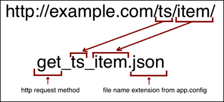
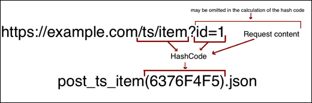
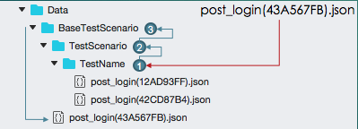
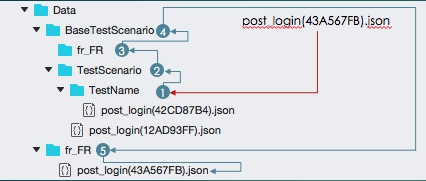
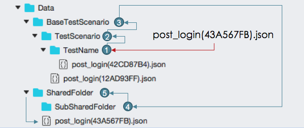

# Mock Data framework

 - [1. How does it work?](#1-how-does-it-work)
 - [2. JSON file name convention](#2-json-file-name-convention):
   - [2.1 Hash calculation](#21-hash-calculation)
 - [3. File searching](#3-file-searching)
   - [3.1 Localization](#31-localization)
   - [3.2 SharedDataFolders](#32shareddata-folders)
 - [4. Routing](#4-routing)
   - [4.1 Skip unecessary segments](#41-skip-unecessary-segments)
   - [4.2 Skip last url parts](#42-skip-last-url-parts)

### 1. How does it work?

Library provides you with handlers, which inherited from `System.Net.Http.HttpMessageHandler`. Handlers intercept app's requests to the Api, process them and return reqired mocked data. There are two handlers in framework:                                                                           
- `RemoteHostHttpHandler`
- `EmbeddedResourceHttpHandler`

`EmbeddedResourceHttpHandler` is default. If you want to use remote host, you must set the Url parameter in `MockFrameworkConfiguration.json`. Handlers return status code 200 “OK” and content of found json file on POST and GET requests. Handlers return status code 404 if necessary file didn’t find. Handlers return status code which contains in found json file on DELETE and PUT requests;
Before execution of each test, test reports the app information about yourself. App constructs necessary handler by this information.

### 2. JSON file name convention

From each caught request framework gets type of request, for example get or post, then it gets all segments from request url, concatenates them and appends to request’s type. 
At the end tool add searched file format, which was set in the app.config file in the UI test project. 

          

##### 2.1 Hash calculation

Also between concatenated segments and file format may be a file hash code. 
It’s calculated from the url segments(path) url query and request body. 
File with hash code is more prioritized in folder than file without hash code. 
It allows you to work with custom mock data when you send custom requests.  


### 3 File searching

Search always goes from the custom to the general. Handler always search file with hash code in each folder, but if file isn't in folder, it will search file without hash. 



  - 1. Framework starts searching in test folder; 
  - 2. If the file isn’t there then tool will try to find file into test scenario’s folder; 
  - 3. After that it will try to search in base test scenario folders etc. Until root DataFolder. 

###### 3.1 Localization

Localized searching has a few differences from default searching; In every test tool try to search also in the language folders included into test or test scenario folder. 



  - 1. During the localized test, framework starts searching in language test  folder;
  - 2. If the file isn’t there then tool will try to find file into language test scenario folder;
  - 3. After that it will try to search in base TS's language folder;
  - 4. In case when base TS language folder doesn't contain necessary file, tool will continue searching inbase  test scenario folder;
  - 5. Search also failed in base TS folder, next folder will root language folder;
  - 6. Successful searching will in root language folder ("Data/fr_FR" contains wanted file);

###### 3.2 SharedData Folders
DataMocker provides to share data between different tests and test scenarios. 



  - 1-3. Same with default searching;
  - 4. But if searching failed in test and TS folders and test scenarion marked with `MockDataAttribute` before searching in root folder, tool will try to find file in first shared folder;
  - 5. If searchin in first folder was failed, tool continue searching in shared folders such as default searching until root folder;

### 4 Routing

##### 4.1 Skip unecessary segments
Framework also  allows you to route handled URLs. It affects the searched file name generation. You can skip unnecessary parts of your URLs.

``` 
    ...
    Routes.AddRoute("api/v1/{controller}/{method}");
    ...
```

    https://example.com/api/v1/Teams/Players/ => https://example.com/Teams/Players
                        ↓                                          ↓
            get_api_v1_teams_palyers.json                get_teams_players.json  

##### 4.2 Skip last url parts
Also you can skip last parts of the url as example:

``` 
    ...
    Routes.AddRoute("Teams/Players/{id1?}/{id2?}");
    ...
```

    https://example.com/Teams/Players/41/32     =>    https://example.com/Teams/Players
                        ↓                                          ↓
            get_teams_palyers_41_32.json                   get_teams_players.json  
    

